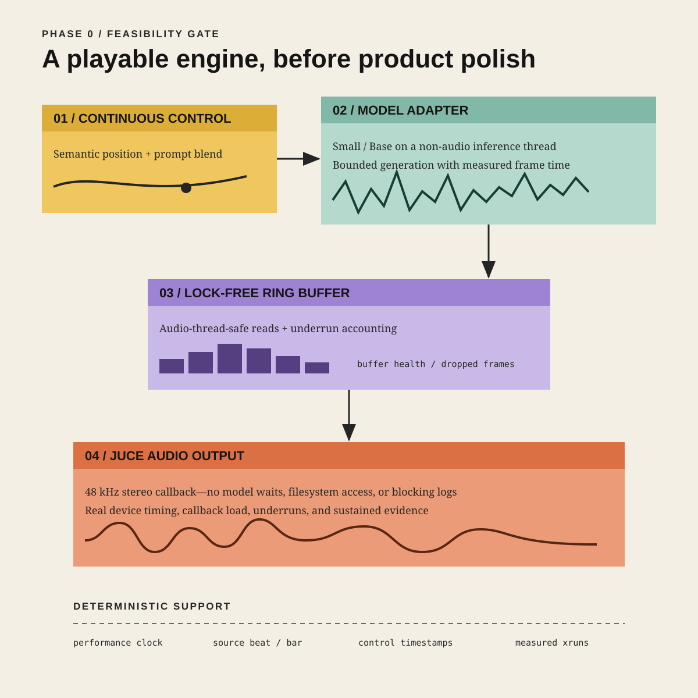

# Song World

Song World is a local-first macOS musical instrument prototype: a listener moves continuously through semantic musical territories while deterministic transport preserves the identity and chronology of the source song.



## Phase 0 result

**Conditional go: Small only on this measured M3 Pro.** The Small model sustained 180.04 seconds of 48 kHz stereo CoreAudio with zero underruns at 1.95× real time; Base achieved only 0.78× real time and failed the gate.

The direct A→B differential test measured 134.9 ms from the control write to the first changed output sample. See the [complete feasibility report](docs/phase0-feasibility-report.md) and [raw evidence inventory](docs/evidence/README.md). That gate now supports the local source-connected milestone below.

## Local source-connected milestone

The local standalone app now seeds MRT2 Small from 28 seconds of a user-provided
golden track, then advances the source master and generated World as
parallel timelines. The exact delivered bundle passed 15.179 seconds of
Home→World→semantic changes→Home interaction with zero underruns; read the
[measured report](docs/source-connected-world-report.md). Perceptual source
identity remains an explicit listening gate, not a claimed result.

## Build and run

Prerequisites are Xcode 26.4, its optional Metal Toolchain component, CMake 3.27.9, and local MRT2 assets. The exact dependency, disk, and licensing record is in [dependencies.md](docs/dependencies.md).

```bash
xcodebuild -downloadComponent MetalToolchain
python3 -m venv ../phase0-tools
../phase0-tools/bin/pip install cmake==3.27.9
env TOOLCHAINS=com.apple.dt.toolchain.Metal.32023.883 \
  ../phase0-tools/bin/cmake -S . -B build -DCMAKE_BUILD_TYPE=Release
env TOOLCHAINS=com.apple.dt.toolchain.Metal.32023.883 \
  ../phase0-tools/bin/cmake --build build --target song_world_phase0 song_world_engine_tests -j 6
../phase0-tools/bin/ctest --test-dir build --output-on-failure
```

Run the passing configuration, replacing the two asset paths:

```bash
env TOOLCHAINS=com.apple.dt.toolchain.Metal.32023.883 \
  build/song_world_phase0_artefacts/Release/song_world_phase0 \
  --engine mrt2 \
  --model /path/to/mrt2_small/mrt2_small.mlxfn \
  --resources /path/to/magenta-rt-v2/resources \
  --duration 30 --device-buffer 512 --ring-buffer 4096 \
  --report small-run.json
```

## Non-negotiable boundaries

- JUCE owns native macOS audio-device integration.
- A deterministic transport owns source beats, bars, and performance time.
- `GenerativeEngine` isolates model-specific behavior.
- Google MRT2 inference runs outside the real-time audio callback.
- The eventual exact Home state is the untouched source master.
- Model assets and test music remain local and outside Git.

## Repository workflow

The bootstrap commit is the only direct `main` change. All implementation work follows branch, focused commits, pull request, and user review/merge; agents never merge.

## Current boundary

The engine and standalone app now prove local source-prefilled generation and
deterministic Home return for one fixed golden-track anchor. Arbitrary import,
beat/bar analysis, separation, Hold/Loop, causal rolling prefill, and perceptual
identity validation remain outside this milestone.
